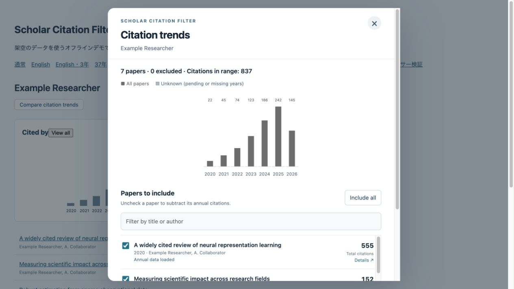

# Scholar Citation Filter

A browser extension for Google Scholar researcher profiles. Compare annual citation trends while selectively excluding individual papers—for example, to see how much a highly cited review contributes to the overall trend.

[English](#english) · [日本語](#日本語)



## English

### Features

- Always provides a **View all** button, even on profiles with only a few years of citation history.
- Opens a chart with a paper list and a checkbox for each paper.
- Subtracts excluded papers' annual citations from the profile's annual totals.
- Uses the original gray bars when all papers are included. After an exclusion, pale gray shows the original totals and darker gray shows the adjusted totals.
- Opens at the rightmost, most recent year and keeps your scroll position when counts update.
- Saves exclusions per profile and caches annual citation data locally for up to 24 hours.
- Leaves the Google Scholar profile, citation table, h-index, and i10-index unchanged.

**Version: 0.1.3 for Firefox and Chrome.** A Mozilla-signed Firefox installer is included. The interface follows Scholar's display language: Japanese or English. Other Scholar languages use English for the extension. This is an independent project, not affiliated with Google or Mozilla.

### Download

- **Firefox 0.1.3:** [Mozilla-signed installer (.xpi)](dist/scholar-citation-filter-firefox-0.1.3.xpi). This installation persists after restarting Firefox. Users do not need a Mozilla account or a signing request.
- **Chrome 0.1.3:** [Chrome package (.zip)](dist/scholar-citation-filter-chrome.zip). Extract it and load its folder in Developer mode.

If a link opens a GitHub file page, use **Download raw file** to save the file. If release assets are available under **Releases**, you can download the same files there. Alternatively, use **Code → Download ZIP** and extract the repository; the installers are inside `dist/`. No command-line tools are needed to use the extension.

The Firefox file ending in **`-unsigned.zip` contains 0.1.3 and is for developer signing submissions**, not normal installation. Use the signed `.xpi` above.

### Install in Firefox

1. Download the signed `.xpi` above. Do not extract it.
2. If you previously loaded the temporary development version, quit and restart Firefox first to remove that temporary installation.
3. Open `about:addons`.
4. In the gear menu, select **Install Add-on From File…**.
5. Select `scholar-citation-filter-firefox-0.1.3.xpi` and confirm **Add**.
6. Open or reload a Google Scholar researcher profile.

The extension remains installed after restarting Firefox. Updates are currently manual: install the signed `.xpi` for the new version using the same steps. [Mozilla installation instructions](https://extensionworkshop.com/documentation/publish/install-self-distributed/#install-add-on-from-file-on-a-computer)

### Install in Chrome

1. Download and extract the Chrome ZIP.
2. Open `chrome://extensions` and enable **Developer mode**.
3. Select **Load unpacked**.
4. Select the extracted folder containing `manifest.json`. If you downloaded the entire repository, select `dist/chrome`.
5. Open or reload a Google Scholar researcher profile.

This method does not require Chrome Web Store registration or signing and normally remains installed after a restart. Keep the loaded folder in the same location. For updates, replace its files, reload the extension on `chrome://extensions`, and reload Scholar. Organization-managed browsers may restrict local extensions. [Chrome installation instructions](https://developer.chrome.com/docs/extensions/get-started/tutorial/hello-world)

This is Chrome's development installation method. On ordinary Windows and macOS installations, a store-external `.crx` does not provide a general one-click installation route. Enterprise-managed environments and Linux have different options. [Chrome distribution documentation](https://developer.chrome.com/docs/extensions/how-to/distribute)

### Use the chart

On Japanese Scholar pages, the extension uses Japanese labels; on English pages it uses English labels.

1. Open a researcher profile and select **View all** in the **Cited by** panel. Depending on the page language, the labels may appear as **すべて表示** and **引用先**. You can also use the added **Compare citation trends / 引用グラフを比較** button below the researcher's name.
2. Uncheck a paper to exclude it. The first exclusion fetches that paper's annual citation data before updating the chart.
3. Select **Include all / すべて含める** to include all papers again. The search box filters the list without changing which papers are included in the calculation.

Closing the popup or selecting **Stop fetching / 取得を停止** stops retrieval. Exclusions are saved separately for each profile.

### Accuracy and limitations

The extension reads Google Scholar's HTML and subtracts annual counts shown on paper detail pages. It does not have access to a complete citation database.

- **Older years may be missing** from a paper's detail chart. Missing, pending, failed, or inconsistent data is shown as unknown (`?` and hatched bars), rather than treated as zero.
- Years outside a paper's chart are treated as zero only when the displayed annual sum matches its total citation count.
- Exact duplicate citation-cluster sets among excluded entries are subtracted once. Partial overlap, or overlap with a retained entry, is marked unknown when contributions cannot be separated.
- Scholar's page structure or access restrictions can stop retrieval. Requests are sequential, at least 1.6 seconds apart. If Scholar requests access verification, resolve it in a regular Scholar tab and retry later.
- Supported domains: `scholar.google.com`, `scholar.google.co.jp`, `scholar.google.co.uk`, `scholar.google.de`, `scholar.google.fr`, `scholar.google.ca`, `scholar.google.com.au`, and `scholar.google.co.in`.

Use the adjusted chart as an exploratory comparison. It does not replace Google Scholar's citation metrics.

The signed Firefox 0.1.3 package has been checked against the included source code. During development, 9 arithmetic tests, 6 language tests, and 10 browser parser tests passed, and the Japanese/English offline interface was checked. Chrome end-to-end retrieval and broad compatibility across Scholar profiles have not been comprehensively verified. No installable Safari release is provided.

### Privacy

Additional requests go only to the same Google Scholar origin as the current page, using the browser's existing Scholar session. Exclusion settings and cached annual data stay in extension-local storage. There is no developer server, analytics, external citation API, or API key. See [Privacy](docs/PRIVACY.md).

### Source and updates

```text
extension/          Extension source
scripts/package.py  Rebuild unsigned Firefox and Chrome packages with Python 3
dist/               Signed Firefox installer, signing ZIP, Chrome folder/ZIP
docs/               Privacy, publishing instructions, and fictional-data screenshot
LICENSE             MIT license
CHANGELOG.md        Version history
```

The demo server and development tests are not included in this distribution directory. To try source changes temporarily in Firefox, open `about:debugging#/runtime/this-firefox`, select **Load Temporary Add-on…**, and choose `extension/manifest.json`. Temporary installations are removed on restart.

For an update, edit `extension/`, increment its manifest version, update the changelog, and run from the repository root:

```sh
python3 scripts/package.py
```

The script uses Python's standard library and creates unsigned packages. It does not modify or generate Mozilla signatures. Obtain a new signature for each Firefox version and add the returned `.xpi` to `dist/`. Signed files must remain unmodified. See [Publishing](docs/PUBLISHING.md) for details.

Licensed under the [MIT License](LICENSE).

## 日本語

Google Scholarの研究者プロフィール上で、論文を選択的に除外し、年別引用数の推移を比較するブラウザ拡張です。大量に引用されたレビュー論文などが全体のトレンドにどれだけ影響しているかを確認できます。

### 機能

- 引用履歴が短いプロフィールでも **「すべて表示」** ボタンを表示します。
- グラフと、論文ごとのチェックボックス付き一覧を開きます。
- 除外した論文の年別引用数を、プロフィールの各年の合計から差し引きます。
- 全論文を含む場合は元と同じグレーの棒で表示します。除外後は元の値が薄いグレー、調整後の値が濃いグレーになります。
- 開くたびに右端の最新年を表示し、集計更新時は手動でスクロールした位置を保ちます。
- 除外設定をプロフィールごとに保存し、年別データを最大24時間ローカルにキャッシュします。
- Scholarのプロフィール、引用数の表、h-index、i10-indexは変更しません。

**Firefox・Chromeともにバージョン0.1.3です。** Mozilla署名済みのFirefox用インストーラーを同梱しています。Scholarの表示言語が日本語なら日本語、英語なら英語になります。それ以外の言語では拡張部分を英語で表示します。GoogleやMozillaとは関係のない独立したプロジェクトです。

### ダウンロード

- **Firefox 0.1.3：** [Mozilla署名済みインストーラー（.xpi）](dist/scholar-citation-filter-firefox-0.1.3.xpi)。Firefoxを再起動しても導入状態が残ります。利用者のMozillaアカウント作成や署名申請は不要です。
- **Chrome 0.1.3：** [Chrome用パッケージ（.zip）](dist/scholar-citation-filter-chrome.zip)。展開してデベロッパーモードでフォルダを読み込みます。

リンク先でGitHubのファイル画面が表示されたら、**Download raw file** で保存してください。**Releases** に配布ファイルがある場合は、そちらからも取得できます。**「Code → Download ZIP」** でリポジトリ全体を取得・展開した場合は、`dist/` に入っています。利用するだけならコマンド操作は不要です。

Firefox用の **`-unsigned.zip` は0.1.3の開発者向け署名申請用** です。通常のインストールには上の署名済み `.xpi` を使用してください。

### Firefoxにインストールする

1. 上の署名済み `.xpi` をダウンロードします。展開は不要です。
2. 一時導入版を使っていた場合は、先にFirefoxを終了して起動し直し、一時導入を解除します。
3. `about:addons` を開きます。
4. 歯車メニューから **「ファイルからアドオンをインストール」** を選びます。
5. `scholar-citation-filter-firefox-0.1.3.xpi` を選び、確認画面で **「追加」** を押します。
6. Scholarの研究者プロフィールを開くか、再読み込みします。

Firefoxを再起動しても導入状態が残ります。更新は現在、手動です。新しい版の署名済み `.xpi` を同じ手順で導入してください。[Mozillaの導入手順](https://extensionworkshop.com/documentation/publish/install-self-distributed/#install-add-on-from-file-on-a-computer)

### Chromeにインストールする

1. Chrome用ZIPをダウンロードして展開します。
2. `chrome://extensions` を開き、**「デベロッパーモード」** をオンにします。
3. **「パッケージ化されていない拡張機能を読み込む」** を押します。
4. 展開した `manifest.json` のあるフォルダを選びます。リポジトリ全体を取得した場合は `dist/chrome` です。
5. Scholarの研究者プロフィールを開くか、再読み込みします。

ストア登録やGoogleの署名は不要で、通常はChromeを再起動しても残ります。読み込んだフォルダは同じ場所に残してください。更新はファイルを差し替え、`chrome://extensions` で拡張を再読み込みしてからScholarも再読み込みします。組織管理のブラウザでは制限される場合があります。[Chromeの導入手順](https://developer.chrome.com/docs/extensions/get-started/tutorial/hello-world)

これはChromeの開発用導入方法です。通常のWindows・macOS版Chromeでは、ストア外の `.crx` を配るだけで簡単に直接導入できるわけではありません。組織管理やLinuxには別の方法があります。[Chromeの配布制限](https://developer.chrome.com/docs/extensions/how-to/distribute)

### グラフを使う

日本語のScholarでは日本語、英語のScholarでは英語のボタンが表示されます。

1. 研究者プロフィールの **「引用先」の「すべて表示」** を押します。ページが英語の場合は **Cited by / View all** です。研究者名の下に追加される **「引用グラフを比較 / Compare citation trends」** からも開けます。
2. 論文のチェックを外すと、その論文を除外します。初回は年別データの取得後にグラフが更新されます。
3. **「すべて含める / Include all」** で全論文の集計へ戻せます。検索は一覧表示の絞り込みだけで、集計対象は変更しません。

ポップアップを閉じるか **「取得を停止 / Stop fetching」** で取得を中止できます。除外設定はプロフィールごとに保存されます。

### 正確性と制約

Scholarの画面HTMLを読み取り、論文詳細に表示された年別引用数を差し引きます。完全な引用データベースへアクセスするものではありません。

- **論文詳細のグラフでは古い年が省略される場合があります。** 省略・未取得・取得失敗・不整合はゼロとせず、斜線の棒と `?` で「不明」と表示します。
- 年別引用数の合計が論文の総引用数に一致する場合だけ、グラフ外の年をゼロとみなします。
- 除外論文の引用レコード集合が完全に同じ場合は一度だけ差し引きます。部分的な重複や残す論文との重複があり、寄与を分離できない場合は不明になります。
- Scholarの画面構造変更やアクセス制限により取得できなくなる場合があります。取得は直列で、開始間隔を最低1.6秒空けます。アクセス確認が出た場合は通常のScholarタブで対応し、時間を置いて再試行してください。
- 対応ドメインは `scholar.google.com`、`scholar.google.co.jp`、`scholar.google.co.uk`、`scholar.google.de`、`scholar.google.fr`、`scholar.google.ca`、`scholar.google.com.au`、`scholar.google.co.in` です。

調整後のグラフは傾向を比較するためのもので、Scholarの引用指標を置き換えるものではありません。

署名済みFirefox 0.1.3の内容が同梱ソースと一致することを確認しています。開発時には集計テスト9件、言語判定・翻訳テスト6件、ブラウザ上のパーサーテスト10件が通過し、日本語・英語のオフライン画面も確認しました。Chromeでの一連の取得処理や、多様なScholarプロフィールでの互換性は十分に検証できていません。インストール可能なSafari版は提供していません。

### プライバシー

追加の通信先は閲覧中のページと同じScholarドメインだけで、ブラウザの通常のScholarセッションを使用します。除外設定と年別データは拡張専用のローカル領域に保存します。開発者のサーバー、アクセス解析、外部の引用データAPI、APIキーはありません。詳細は[プライバシー説明](docs/PRIVACY.md)を参照してください。

### ソースと更新

```text
extension/          アドオン本体のソース
scripts/package.py  Python 3で署名前Firefox・Chromeパッケージを再生成
dist/               Firefox署名済みXPI・申請用ZIP・ChromeフォルダとZIP
docs/               プライバシー・公開手順・架空データの画像
LICENSE             MITライセンス
CHANGELOG.md        変更履歴
```

デモサーバーと開発用テストは公開用フォルダには含めていません。Firefoxでソース変更を試す場合は `about:debugging#/runtime/this-firefox` の **「一時的なアドオンを読み込む…」** から `extension/manifest.json` を選びます。一時導入は再起動すると解除されます。

更新時は `extension/` のソース、manifestのバージョン、変更履歴を修正し、リポジトリのルートで実行します。

```sh
python3 scripts/package.py
```

Python標準ライブラリのみを使い、署名前のパッケージを生成します。このスクリプトでMozillaの署名を生成したり変更したりはしません。Firefoxは版ごとに新たな署名を取得し、返された `.xpi` を `dist/` に追加してください。署名済みファイルは編集しません。詳細は[公開用メモ](docs/PUBLISHING.md)に記載しています。

[MITライセンス](LICENSE)で公開します。
